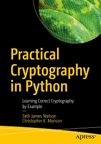

# Apress Source Code

This repository accompanies [*Cryptography in Python Source Code*](https://www.apress.com/9781484248997) by Seth Nielson and Christopher K. Monson (Apress, 2019).

[comment]: #cover

Download the files as a zip using the green button, or clone the repository to your machine using Git.

## Releases

Release v1.0 corresponds to the code in the published book, without corrections or updates.

## Contributions

See the file Contributing.md for more information on how you can contribute to this repository.

## Listing Types

There are two types of listings in the book. The first is typical Python code meant to be executed as a Python script. These can be executed directly from the command line with the appropriate configuration as described in Chapter 1. 

The other files are representations of Python commands executed in a Python interactive shell. We have included these snippets in files ending with ".pyprompt". Obviously, these cannot be run from the command line but you can copy each individual command into a shell if you would like to re-create the output.

## Differences from Listings

The source code herein is not a perfect one-to-one match to source code listings in the book. For one thing, some book listings were shortened or simplified for space constraints or clarity. In other cases, multiple listings within the book are taken from a single file. Occasionally, there is a very small change to the actual code for similar reasons.

Most of the included Python programs also include a simple main function that performs a simplistic sanity check to test that the code is working correctly. It would have been better to use Python's unittest framework but there were a couple of reasons this solution wasn't the default. Most of these programs, if run, will output either "[PASS]" (if everything worked correctly) or "[FAIL]" otherwise. For some, there is an explicit "--auto-tester" value checked at the command line that can be safely ignored.

## Prerequisites

While most of the included examples are completely self-contained, there are a few that must be run together or require some special inputs. These prerequisites are listed in the book. If something doesn't seem to work right, make sure that you are following the instructions.

